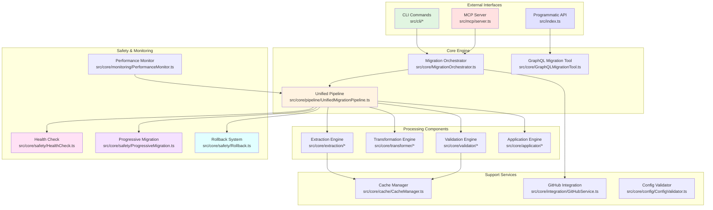
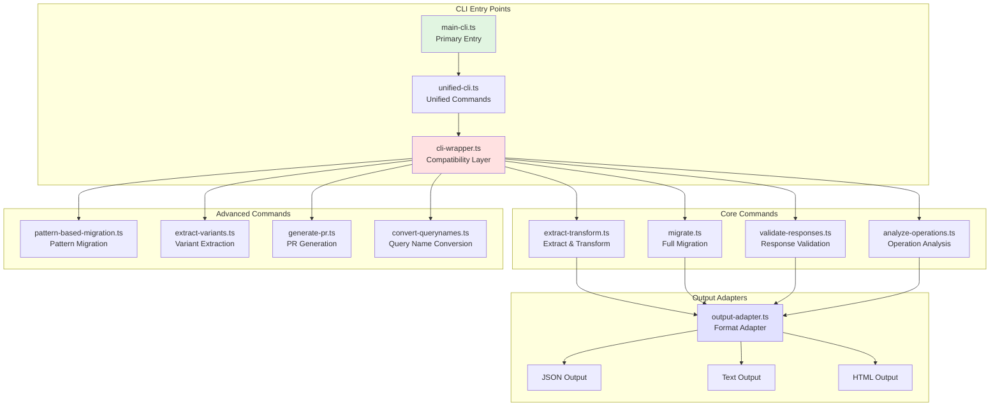
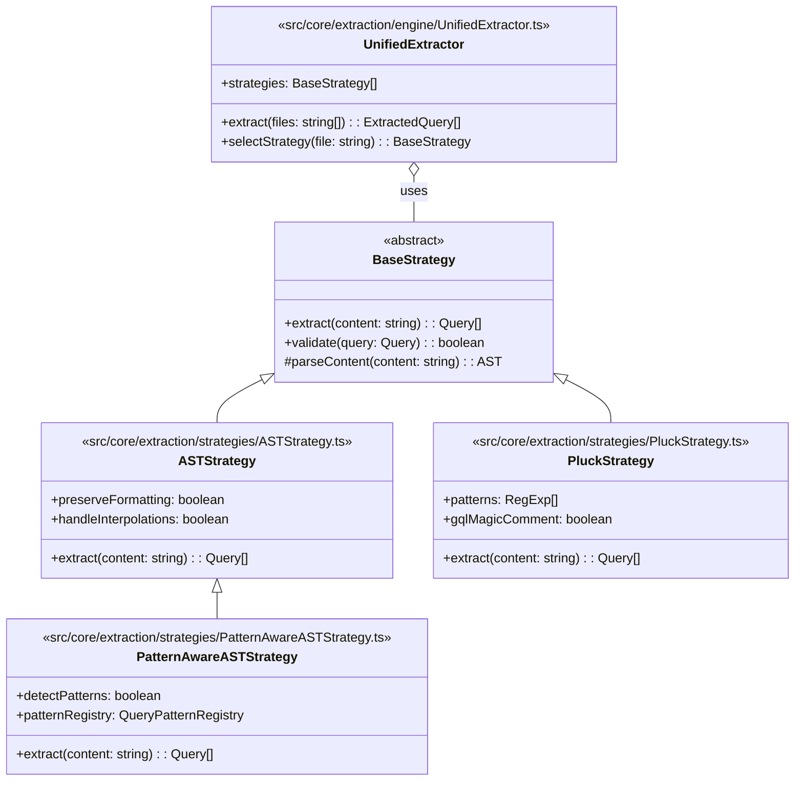
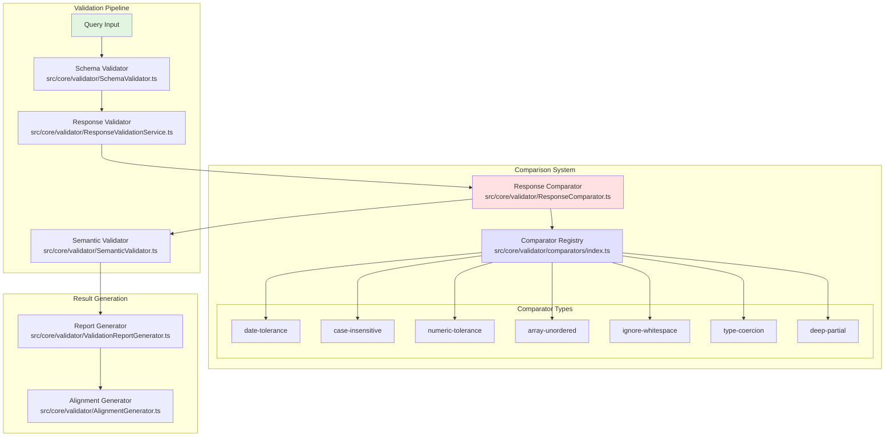
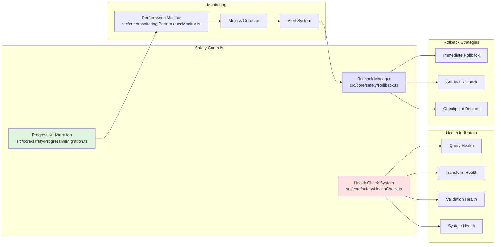
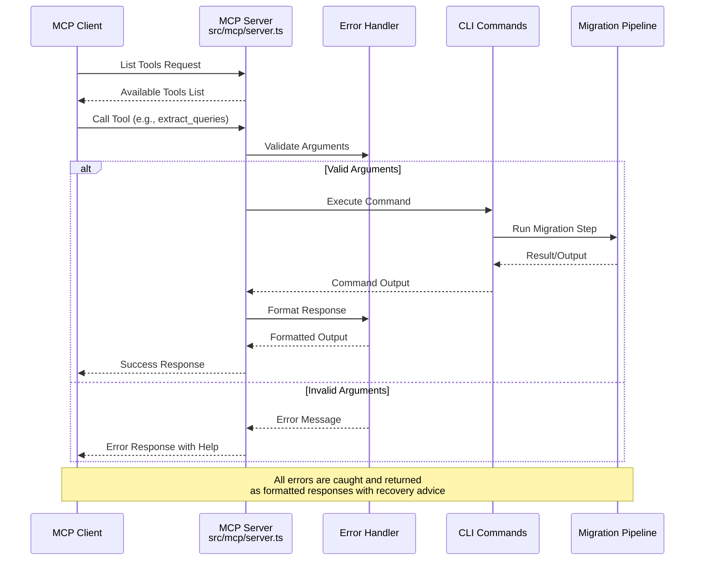
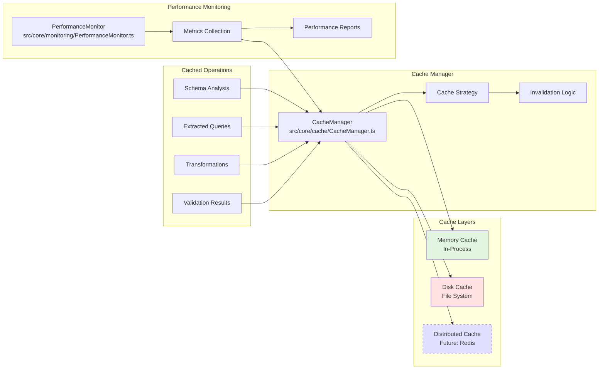
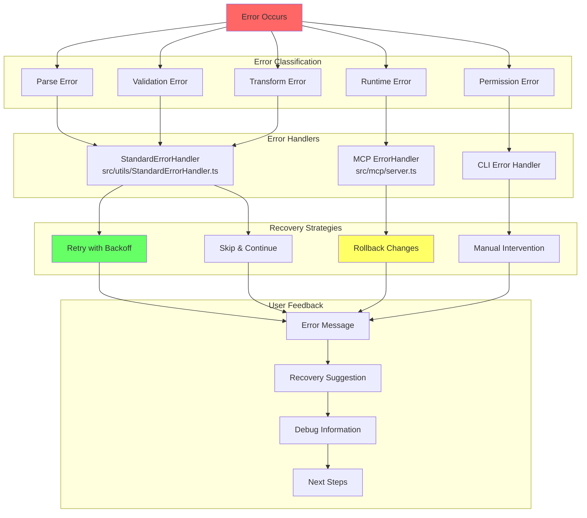

# GraphQL Migration Tool - Architecture & Process Diagrams

## 1. High-Level System Architecture

## 2. Migration Pipeline Flow

```mermaid
flowchart LR
    subgraph "Input Phase"
        SOURCE[Source Code<br/>*.ts, *.tsx, *.js, *.jsx]
        SCHEMA[GraphQL Schema<br/>schema.graphql]
        CONFIG[Configuration<br/>pg-migration.config.js]
    end

    subgraph "Extraction Phase"
        SCAN[Code Scanner<br/>src/core/scanner/*]
        EXTRACT[Query Extractor<br/>src/core/extraction/UnifiedExtractor.ts]
        ANALYZE[Query Analyzer<br/>src/core/extraction/analyzers/*]

        SOURCE --> SCAN
        SCAN --> EXTRACT
        EXTRACT --> ANALYZE
        ANALYZE --> QUERIES[Extracted Queries<br/>JSON Format]
    end

    subgraph "Analysis Phase"
        DEPRECATION[Deprecation Analyzer<br/>src/core/analyzer/SchemaDeprecationAnalyzer.ts]
        PATTERN[Pattern Matcher<br/>src/core/analyzer/PatternMatcher.ts]
        CONFIDENCE[Confidence Scorer<br/>src/core/analyzer/ConfidenceScorer.ts]

        QUERIES --> DEPRECATION
        SCHEMA --> DEPRECATION
        DEPRECATION --> PATTERN
        PATTERN --> CONFIDENCE
        CONFIDENCE --> REPORT[Analysis Report]
    end

    subgraph "Transformation Phase"
        TRANSFORMER[Schema Transformer<br/>src/core/transformer/OptimizedSchemaTransformer.ts]
        VALIDATOR[Transform Validator<br/>src/core/validator/SchemaValidator.ts]

        REPORT --> TRANSFORMER
        TRANSFORMER --> VALIDATOR
        VALIDATOR --> TRANSFORMED[Transformed Queries]
    end

    subgraph "Validation Phase"
        RESPONSE[Response Validator<br/>src/core/validator/ResponseValidationService.ts]
        COMPARATOR[Response Comparator<br/>src/core/validator/ResponseComparator.ts]
        SEMANTIC[Semantic Validator<br/>src/core/validator/SemanticValidator.ts]

        TRANSFORMED --> RESPONSE
        RESPONSE --> COMPARATOR
        COMPARATOR --> SEMANTIC
        SEMANTIC --> VALIDATED[Validated Queries]
    end

    subgraph "Application Phase"
        APPLICATOR[AST Code Applicator<br/>src/core/applicator/ASTCodeApplicator.ts]
        CALCULATOR[Change Calculator<br/>src/core/applicator/MinimalChangeCalculator.ts]

        VALIDATED --> APPLICATOR
        APPLICATOR --> CALCULATOR
        CALCULATOR --> OUTPUT[Updated Source Files]
    end

    style SOURCE fill:#e1f5e1
    style SCHEMA fill:#e1f5e1
    style CONFIG fill:#e1f5e1
    style OUTPUT fill:#ffe1e1
```

## 3. CLI Command Architecture

## 4. Extraction Strategy Hierarchy

## 5. Validation & Comparison System

## 6. Safety & Monitoring Architecture

## 7. MCP Server Integration

## 8. Test Architecture Overview

```mermaid
graph TB
    subgraph "Unit Tests"
        ANALYZER_TESTS[Analyzer Tests<br/>src/test/analyzer/*]
        EXTRACTOR_TESTS[Extractor Tests<br/>src/test/extraction/*]
        VALIDATOR_TESTS[Validator Tests<br/>src/test/validator/*]
        TRANSFORMER_TESTS[Transformer Tests<br/>src/test/transformer/*]
    end

    subgraph "Integration Tests"
        PIPELINE_TESTS[Pipeline Tests<br/>src/test/pipeline/*]
        CLI_TESTS[CLI Tests<br/>src/test/cli/*]
        E2E_TESTS[End-to-End Tests<br/>src/test/integration/*]
    end

    subgraph "Specialized Tests"
        SAFETY_TESTS[Safety Tests<br/>src/test/core/safety/*]
        PERF_TESTS[Performance Tests<br/>src/test/performance/*]
        EDGE_TESTS[Edge Case Tests<br/>*edge-cases.test.ts]
    end

    subgraph "Test Utilities"
        MOCK_FACTORY[Mock Factory<br/>src/test/utils/mockFactory.ts]
        TEST_HELPERS[Test Helpers<br/>src/test/utils/testHelpers.ts]
        PERF_TRACKER[Performance Tracker<br/>src/test/utils/performanceTracker.ts]
    end

    ANALYZER_TESTS --> MOCK_FACTORY
    EXTRACTOR_TESTS --> MOCK_FACTORY
    VALIDATOR_TESTS --> MOCK_FACTORY
    TRANSFORMER_TESTS --> MOCK_FACTORY

    PIPELINE_TESTS --> TEST_HELPERS
    CLI_TESTS --> TEST_HELPERS
    E2E_TESTS --> TEST_HELPERS

    PERF_TESTS --> PERF_TRACKER

    style SAFETY_TESTS fill:#ffe1e1
    style PERF_TESTS fill:#e1f5e1
    style EDGE_TESTS fill:#e1e1ff
```

## 9. Cache & Performance Strategy

## 10. Error Handling & Recovery Flow

## Quick Reference

### Key Entry Points

- **CLI**: `src/cli/main-cli.ts`
- **MCP Server**: `src/mcp/server.ts`
- **API**: `src/index.ts`
- **Pipeline**: `src/core/pipeline/UnifiedMigrationPipeline.ts`

### Core Components

- **Orchestrator**: `src/core/MigrationOrchestrator.ts`
- **Extractor**: `src/core/extraction/engine/UnifiedExtractor.ts`
- **Transformer**: `src/core/transformer/OptimizedSchemaTransformer.ts`
- **Validator**: `src/core/validator/ResponseValidationService.ts`
- **Applicator**: `src/core/applicator/ASTCodeApplicator.ts`

### Safety Systems

- **Health Check**: `src/core/safety/HealthCheck.ts`
- **Progressive Migration**: `src/core/safety/ProgressiveMigration.ts`
- **Rollback**: `src/core/safety/Rollback.ts`
- **Performance Monitor**: `src/core/monitoring/PerformanceMonitor.ts`

### Recent Additions

- **MCP Server**: Model Context Protocol integration for AI assistance
- **CLI Compatibility**: Backward-compatible wrapper for automation
- **Comparator Registry**: Type-safe response comparison system
- **Enhanced Safety**: Health checks and progressive migration
- **Performance Monitoring**: Real-time performance tracking
