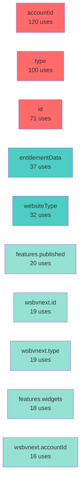

# RAD Data Usage - Visual Summary

Analyzing **144 synthesizers** using **104 unique data fields**

## 📊 Most Commonly Used Data

```
accountId                           ████████████████████████████████████████ 120 ( 83%)
type                                █████████████████████████████████ 100 ( 69%)
id                                  ███████████████████████  71 ( 49%)
entitlementData                     ████████████  37 ( 26%)
websiteType                         ██████████  32 ( 22%)
features.published                  ██████  20 ( 14%)
wsbvnext.id                         ██████  19 ( 13%)
wsbvnext.type                       ██████  19 ( 13%)
features.widgets                    ██████  18 ( 12%)
wsbvnext.accountId                  █████  16 ( 11%)
billing.commitment                  █████  15 ( 10%)
wsbvnext.customerIntentions         █████  15 ( 10%)
mktgasst.id                         ████  12 (  8%)
mktgasst.type                       ████  12 (  8%)
features.planType                   ████  12 (  8%)
account.paymentStatus               ███  11 (  8%)
customerIntentions                  ███   9 (  6%)
entitlements.current                ███   9 (  6%)
commerce.productCount               ██   8 (  6%)
appointments.serviceCount           ██   7 (  5%)
```

## 📂 Data Categories Overview

### 🔑 Core Identity
- **12 unique fields** | **326 total uses** | **27.2 avg uses/field**

| Field | Usage | Synthesizers |
|-------|-------|-------------|
| `accountId` | 120 | mktgasst, wsbvnext |
| `type` | 100 | mktgasst, o365, vnextgraph, wsbvnext |
| `id` | 71 | mktgasst, wsbvnext |
| `wsbvnext.accountId` | 16 | unknown, wsbvnext |
| `account.paymentStatus` | 11 | mktgasst, wsbvnext |
| ... +7 more fields | | |

### 📦 Other Data
- **31 unique fields** | **119 total uses** | **3.8 avg uses/field**

| Field | Usage | Synthesizers |
|-------|-------|-------------|
| `wsbvnext.type` | 19 | unknown, wsbvnext |
| `wsbvnext.id` | 19 | unknown, wsbvnext |
| `mktgasst.id` | 12 | unknown |
| `mktgasst.type` | 12 | unknown |
| `features.planType` | 12 | mktgasst, wsbvnext |
| ... +26 more fields | | |

### 🌐 Website Settings
- **6 unique fields** | **74 total uses** | **12.3 avg uses/field**

| Field | Usage | Synthesizers |
|-------|-------|-------------|
| `websiteType` | 32 | mktgasst, wsbvnext |
| `features.published` | 20 | mktgasst, wsbvnext |
| `features.widgets` | 18 | unknown, wsbvnext |
| `wsbvnext.features.published` | 2 | unknown, wsbvnext |
| `domainName` | 1 | wsbvnext |
| ... +1 more fields | | |

### 🎫 Feature Entitlements
- **11 unique fields** | **60 total uses** | **5.5 avg uses/field**

| Field | Usage | Synthesizers |
|-------|-------|-------------|
| `entitlementData` | 37 | mktgasst, wsbvnext |
| `entitlements.current` | 9 | mktgasst, wsbvnext |
| `entitlements.current.commerce` | 4 | wsbvnext |
| `entitlements.current.blog` | 2 | wsbvnext |
| `entitlements.current.appointments` | 2 | wsbvnext |
| ... +6 more fields | | |

### 📱 Marketing & Social
- **10 unique fields** | **32 total uses** | **3.2 avg uses/field**

| Field | Usage | Synthesizers |
|-------|-------|-------------|
| `features.facebook.pageId` | 7 | mktgasst, wsbvnext |
| `email.subscriberCount` | 5 | wsbvnext |
| `social.lastFacebookPost` | 5 | mktgasst, wsbvnext |
| `features.facebook.isConnected` | 5 | mktgasst, wsbvnext |
| `email.hasSent` | 3 | wsbvnext |
| ... +5 more fields | | |

### 🛒 E-commerce
- **11 unique fields** | **25 total uses** | **2.3 avg uses/field**

| Field | Usage | Synthesizers |
|-------|-------|-------------|
| `commerce.productCount` | 8 | wsbvnext |
| `links.olsAddProducts` | 4 | wsbvnext |
| `links.olsMarketplace` | 3 | wsbvnext |
| `ols.setup_status` | 2 | wsbvnext |
| `ols.marketplace_data` | 2 | wsbvnext |
| ... +6 more fields | | |

### 👤 Customer Data
- **3 unique fields** | **25 total uses** | **8.3 avg uses/field**

| Field | Usage | Synthesizers |
|-------|-------|-------------|
| `wsbvnext.customerIntentions` | 15 | mktgasst, unknown |
| `customerIntentions` | 9 | wsbvnext |
| `contacts` | 1 | wsbvnext |

### 💳 Billing & Payments
- **5 unique fields** | **21 total uses** | **4.2 avg uses/field**

| Field | Usage | Synthesizers |
|-------|-------|-------------|
| `billing.commitment` | 15 | mktgasst, wsbvnext |
| `billing.autoRenew` | 2 | wsbvnext |
| `billing.termType` | 2 | wsbvnext |
| `ols.payment_methods.available` | 1 | wsbvnext |
| `ola.online_payment.status` | 1 | wsbvnext |

### 🔗 Navigation Links
- **11 unique fields** | **18 total uses** | **1.6 avg uses/field**

| Field | Usage | Synthesizers |
|-------|-------|-------------|
| `links.composeCampaign` | 4 | wsbvnext |
| `links.sev` | 2 | wsbvnext |
| `links.editorDirect` | 2 | wsbvnext |
| `links.yelpLaunch` | 2 | mktgasst |
| `links.addSubscribers` | 2 | wsbvnext |
| ... +6 more fields | | |

### 📅 Appointments
- **4 unique fields** | **16 total uses** | **4.0 avg uses/field**

| Field | Usage | Synthesizers |
|-------|-------|-------------|
| `appointments.serviceCount` | 7 | wsbvnext |
| `appointments.status` | 6 | wsbvnext |
| `ola.calendar_sync.status` | 2 | wsbvnext |
| `ola.notifications.c1_sms` | 1 | wsbvnext |

## 🔄 Common Data Access Patterns

## 🔗 Most Shared Data Fields

Fields used by 10+ synthesizers (strong indicators of core data):



## 💡 Key Insights

### Critical Data (used by >50% of synthesizers)
- `accountId` - 83% of synthesizers
- `type` - 69% of synthesizers

### Rarely Used Data (48 fields used by only 1 synthesizer)
Consider if these are still needed or can be consolidated.

### Fields with Multiple Access Patterns
These fields are accessed inconsistently and should be standardized:
- `entitlements.current` - 6 different access patterns
- `billing` - 3 different access patterns
