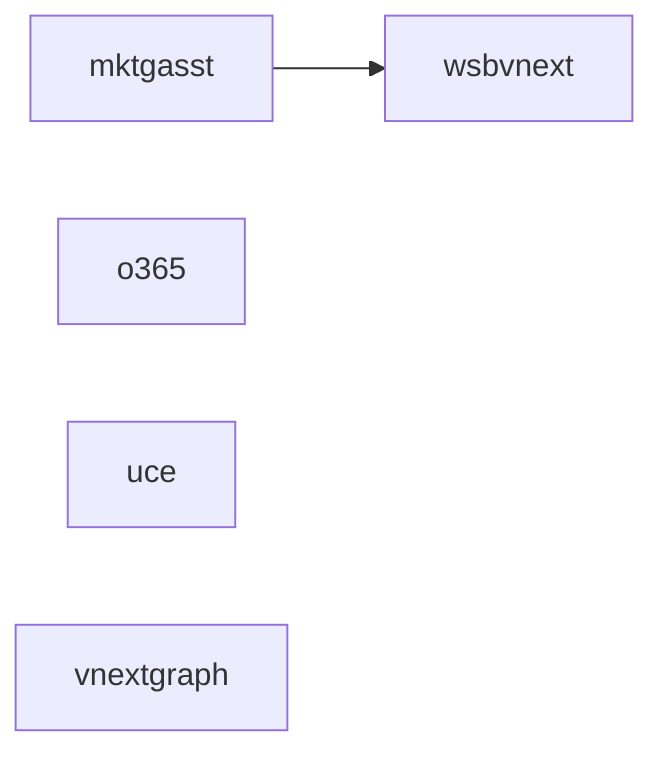

# RAD Field Usage Analysis - Detailed Report

## Overview
- **Total Synthesizers:** 144
- **Unique Fields:** 102
- **Entity Types:** 5
- **Total Field Accesses:** 562

# Field Usage Mapping Table

This table shows which fields are used by which entity types and how often.

| Field | wsbvnext | unknown | mktgasst | vnextgraph | uce | o365 | Total |
|-------|-------|-------|-------|-------|-------|-------|-------|
| `accountId` | 93 | - | 27 | - | - | - | 120 |
| `type` | 28 | - | 69 | 2 | - | 1 | 100 |
| `id` | 27 | - | 44 | - | - | - | 71 |
| `entitlementData` | 30 | - | 7 | - | - | - | 37 |
| `websiteType` | 27 | - | 5 | - | - | - | 32 |
| `features.published` | 14 | - | 6 | - | - | - | 20 |
| `features.widgets` | 14 | 4 | - | - | - | - | 18 |
| `wsbvnext.id` | - | 18 | - | - | - | - | 18 |
| `wsbvnext.type` | - | 18 | - | - | - | - | 18 |
| `wsbvnext.accountId` | - | 15 | - | - | - | - | 15 |
| `billing.commitment` | 14 | - | - | - | - | - | 14 |
| `wsbvnext.customerIntentions` | - | 14 | - | - | - | - | 14 |
| `mktgasst.id` | - | 12 | - | - | - | - | 12 |
| `mktgasst.type` | - | 12 | - | - | - | - | 12 |
| `account.paymentStatus` | 10 | - | - | - | - | - | 10 |
| `customerIntentions` | 9 | - | - | - | - | - | 9 |
| `entitlements.current` | - | - | 6 | - | - | - | 6 |
| `wsbvnext.features` | - | 5 | - | - | - | - | 5 |
| `features.planType` | - | - | 5 | - | - | - | 5 |
| `features.facebook.pageId` | - | - | 5 | - | - | - | 5 |
| `social.lastFacebookPost` | - | - | 4 | - | - | - | 4 |
| `mktgasst.features.facebook.isConnected` | - | 2 | - | - | - | - | 2 |
| `mktgasst.features.gmb.hasGMBPublished` | - | 2 | - | - | - | - | 2 |
| `features` | - | - | - | - | 1 | - | 1 |

# Entity Relationships

# Fields by Business Category

## Authentication

Total field accesses in this category: **139**

- `accountId`: 120 times (21.4% of all accesses)
- `wsbvnext.accountId`: 16 times (2.8% of all accesses)
- `vnextAccount.shopperId`: 1 times (0.2% of all accesses)
- `account.planType`: 1 times (0.2% of all accesses)
- `wsbvnext.accountCreationListingId`: 1 times (0.2% of all accesses)

## Billing

Total field accesses in this category: **31**

- `billing.commitment`: 15 times (2.7% of all accesses)
- `account.paymentStatus`: 11 times (2.0% of all accesses)
- `billing.termType`: 2 times (0.4% of all accesses)
- `billing.autoRenew`: 2 times (0.4% of all accesses)
- `ola.online_payment.status`: 1 times (0.2% of all accesses)

## Features

Total field accesses in this category: **62**

- `features.published`: 20 times (3.6% of all accesses)
- `features.widgets`: 18 times (3.2% of all accesses)
- `features.planType`: 12 times (2.1% of all accesses)
- `features.facebook.pageId`: 7 times (1.2% of all accesses)
- `wsbvnext.features`: 5 times (0.9% of all accesses)

## Entitlements

Total field accesses in this category: **54**

- `entitlementData`: 37 times (6.6% of all accesses)
- `entitlements.current`: 9 times (1.6% of all accesses)
- `entitlements.current.commerce`: 4 times (0.7% of all accesses)
- `entitlements.current.blog`: 2 times (0.4% of all accesses)
- `entitlements.current.appointments`: 2 times (0.4% of all accesses)

## Social Media

Total field accesses in this category: **8**

- `social.lastFacebookPost`: 5 times (0.9% of all accesses)
- `social.lastInstagramPost`: 2 times (0.4% of all accesses)
- `ola.facebook_booking.status`: 1 times (0.2% of all accesses)

## Commerce

Total field accesses in this category: **19**

- `commerce.productCount`: 8 times (1.4% of all accesses)
- `links.olsAddProducts`: 4 times (0.7% of all accesses)
- `links.olsMarketplace`: 3 times (0.5% of all accesses)
- `ols.setup_status`: 2 times (0.4% of all accesses)
- `ols.marketplace_data`: 2 times (0.4% of all accesses)

## Appointments

Total field accesses in this category: **17**

- `appointments.serviceCount`: 7 times (1.2% of all accesses)
- `appointments.status`: 6 times (1.1% of all accesses)
- `ola.calendar_sync.status`: 2 times (0.4% of all accesses)
- `ola.account.has_business_address`: 1 times (0.2% of all accesses)
- `ola.notifications.c1_sms`: 1 times (0.2% of all accesses)

# Common Synthesizer Patterns

## Simple Entity Filter
**Description:** Simple filtering of entities with field selection
**Count:** 73 synthesizers

Examples:
- Task-AddGEMSubscribers-gHLTYfjQb
- Task-AddMoreProducts-wLwoZl_J6
- Task-PromoteAppointmentService-EBVqroHvQ
- Task-ReadBlogging-uQzCHoLKn
- Task-AddHeaderImage-GQZD61oxC
- ... and 68 more

## Entity Join
**Description:** Joins multiple entity types (e.g., mktgasst + wsbvnext)
**Count:** 34 synthesizers

Examples:
- Guidance-Local-2-jDYwffkHC
- Guidance-GetNoticed-2-ODfCE4BVy
- Guidance-Appointments-1-Cs1c8jdv9
- Guidance-DmFull-SocialEmail-1-GmfspIsuO
- Task-CreateGMB-rVIKdnkfH
- ... and 29 more

## Conditional Return
**Description:** Returns data based on conditions
**Count:** 3 synthesizers

Examples:
- Task-SetupOLANotifications-zen_KPiqs
- Task-ConnectSocialAccounts-leCIpNDXg(copy)-hhIvw3CG0
- Task-ViewMySubscribers-TCLmO4CU3

## Static Return
**Description:** Always returns empty or static data
**Count:** 34 synthesizers

Examples:
- Task-Upgrade-RemoveAds-ZsVan1Rs~
- Task-SubscriptionsCouponOrInsights-EfdGoWY3R
- Task-DoEmailGEMCampaign-Social-Tile-R9MtcarCi
- Task-DoPostToFacebook-Holiday-Sales-Tile-VUO1ImXfw
- Task-WaysToSell-VTk695TTb
- ... and 29 more

# Field Access Variations Analysis

This shows how the same logical data is accessed through different field paths.

## billing
This data is accessed in **3** different ways:

- `vnextAccount.billing.autoRenew`
- `vnextAccount.billing.commitment`
- `vnextAccount.billing.termType`

## entitlements.current
This data is accessed in **6** different ways:

- `entitlementData.current`
- `entitlementData.current.appointments`
- `entitlementData.current.blog`
- `entitlementData.current.commerce`
- `entitlementData.current.conversations`
- `entitlementData.current[`

# Recommendations

## Standardize Field Access
The following fields are accessed inconsistently:

- `billing` has 3 variations
- `entitlements.current` has 6 variations

Consider standardizing these to reduce complexity.

## Simplify Complex Synthesizers
Found **6** complex synthesizers that might benefit from simplification.

## Review Static Returns
Found **34** synthesizers that always return empty/static data.
Consider if these are still needed.

