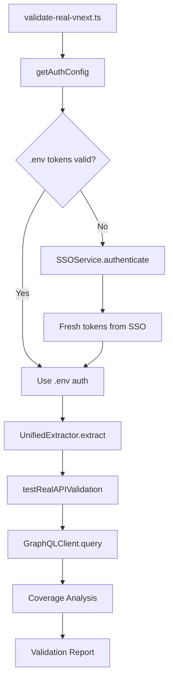

# Real vnext Validation System

## Overview

The real vnext validation system provides comprehensive authentication and API testing capabilities for GraphQL migration validation. This system includes automated auth token management, SSO fallback, and real API endpoint testing.

## 🔐 Authentication System

### Primary Auth (.env tokens)

```bash
# .env file configuration
auth_idp=eyJhbGciOiAiUlMyNTYi...
cust_idp=eyJhbGciOiAiUlMyNTYi...
info_cust_idp=%7B%22typ%22%3A%20%22idp%22...
info_idp=%7B%22typ%22%3A%20%22idp%22...
```

### SSO Service Fallback

When .env tokens are expired or invalid, the system automatically falls back to SSO authentication:

```bash
# SSO credentials in .env
SSO_USER=tmg
SSO_PASS=Pollersmallaccount123
```

## 🚀 Usage

### 1. Real vnext Validation

```bash
npx tsx validate-real-vnext.ts [path-to-vnext-code]
```

**Features:**

- ✅ Automatic auth detection (.env vs SSO)
- ✅ GraphQL query extraction from vnext codebase
- ✅ Real API endpoint testing
- ✅ Response validation with transformation analysis
- ✅ Coverage scoring (>=85% target)

**Sample Output:**

```
🎯 Real vnext validation with .env auth headers and SSO fallback

✅ Authentication: env (expires: N/A)
📂 Vnext path: ./src/test/fixtures/sample-vnext
✅ Extracted 5 queries from vnext
📊 Endpoints: productGraph, offerGraph

📊 Real vnext validation results:
✅ Successful queries: 3
❌ Failed queries: 2
📈 Success rate: 60.0%
```

### 2. Auth Diagnosis

```bash
npx tsx diagnose-auth.ts
```

**Features:**

- 🔍 Tests current auth token validity
- 🔄 Automatic SSO refresh when needed
- 📋 Detailed diagnostics with HTTP status codes
- 🆕 Provides fresh tokens for .env update

**Sample Output:**

```
🩺 Auth Token Diagnosis and Refresh Tool

❌ Current auth tokens are not working
📋 Reason: Tokens expired - redirected to login page
📊 HTTP Status: 302

🔄 Attempting to refresh tokens with SSO...
✅ SSO refresh successful!

🔑 New auth tokens (update your .env file):
auth_idp=eyJhbGciOiAiUlMyNTYi...
# Expires: 2025-07-16T05:45:34.735Z
```

### 3. API Format Debugging

```bash
npx tsx test-api-format.ts
```

**Features:**

- 🧪 Tests multiple GraphQL request formats
- 🌐 Tests different endpoint configurations
- 📊 Analyzes response formats and status codes
- 💡 Provides debugging guidance

## 🏗️ Architecture

### Components

1. **validate-real-vnext.ts** - Main validation orchestrator
   - Query extraction via UnifiedExtractor
   - Auth management with automatic fallback
   - Real API testing with GraphQLClient
   - Coverage analysis and reporting

2. **diagnose-auth.ts** - Auth token management
   - Token validity testing
   - SSO service integration
   - Automatic token refresh
   - Security-focused logging

3. **test-api-format.ts** - API debugging utility
   - Request format testing
   - Endpoint discovery
   - Response analysis
   - Troubleshooting guidance

4. **SSOService.ts** - GoDaddy SSO integration
   - Automated SSO authentication
   - Cookie extraction and caching
   - Token expiry management
   - Error handling with retry logic

### Data Flow



## 🔧 Configuration

### Environment Variables

```bash
# GraphQL Endpoints
APOLLO_PG_ENDPOINT=https://pg.api.godaddy.com/v1/gql/customer
APOLLO_OG_ENDPOINT=https://og.api.godaddy.com/v1/graphql

# SSO Configuration
SSO_ENDPOINT=https://sso.godaddy.com/v1/auth
SSO_CLIENT_ID=pg-migration
SSO_USER=tmg
SSO_PASS=Pollersmallaccount123

# Auth Cookies (refreshed automatically)
auth_idp=eyJhbGci...
cust_idp=eyJhbGci...
info_cust_idp=%7B%22...
info_idp=%7B%22...

# Security Settings
DISABLE_SSL_VERIFY=false
REQUEST_TIMEOUT=30000
```

### Query Variable Mapping

The system automatically maps common GraphQL variables:

```typescript
const variableMapping = {
  ventureId: 'a5a1a68d-cfe8-4649-8763-71ad64d62306',
  domainName: 'example.com',
  id: 'test-uuid',
  limit: 10,
  offset: 0,
};
```

## 📊 Validation Criteria

### Success Metrics

- **Query Extraction**: Successfully extracts GraphQL queries from vnext codebase
- **Auth Validation**: Valid authentication to GraphQL endpoints
- **API Response**: Receives proper GraphQL responses (data or errors)
- **Coverage Score**: >=85% successful query execution rate

### Error Categories

1. **Auth Errors**: Token expiry, SSO failures, cookie issues
2. **Query Errors**: Invalid GraphQL syntax, missing fragments
3. **Network Errors**: Endpoint connectivity, timeout issues
4. **Validation Errors**: Schema mismatches, type errors

## 🛡️ Security Features

### Token Management

- ✅ Automatic token refresh before expiry
- ✅ Secure logging with token masking
- ✅ Cookie expiration tracking
- ✅ SSO credential validation

### Security Best Practices

```typescript
// Token masking in logs
console.log('Cookie:', cookieString.replace(/=[^;]+/g, '=***'));

// Secure token storage
const cookies: GoDaddySSO = {
  auth_idp: 'masked-in-logs',
  cust_idp: 'masked-in-logs',
  // ...
};

// Leak detection
const hasTokenLeaks = /auth_idp=[^*]|cust_idp=[^*]/.test(logOutput);
```

## 🧪 Testing Strategy

### Test Types

1. **Unit Tests**: Individual component validation
2. **Integration Tests**: Auth flow validation
3. **E2E Tests**: Complete pipeline validation
4. **Performance Tests**: API response timing

### Test Data

- **Sample vnext code**: `/src/test/fixtures/sample-vnext/`
- **Mock responses**: `/validation-storage/`
- **Test queries**: Pre-defined GraphQL operations

## 🚨 Troubleshooting

### Common Issues

**1. Auth Token Expiry**

```bash
# Symptoms: 302 redirects, HTML login pages
# Solution: Run diagnose-auth.ts
npx tsx diagnose-auth.ts
```

**2. Invalid Query Format**

```bash
# Symptoms: 400 Bad Request, "Invalid request"
# Solution: Check query syntax and variables
npx tsx test-api-format.ts
```

**3. Network Connectivity**

```bash
# Symptoms: ENOTFOUND, ECONNREFUSED
# Solution: Check VPN, firewall, endpoint URLs
curl -I https://pg.api.godaddy.com/v1/gql/customer
```

**4. Schema Validation Errors**

```bash
# Symptoms: GraphQL validation errors
# Solution: Update schema or fix query structure
npx vitest run src/test/validator/validation-edge-cases.test.ts
```

### Debug Commands

```bash
# Test auth validity
npx tsx diagnose-auth.ts

# Debug API format
npx tsx test-api-format.ts

# Test query extraction
npx tsx validate-real-vnext.ts ./path/to/vnext

# Validate specific endpoint
curl -X POST https://og.api.godaddy.com/v1/graphql \
  -H "Content-Type: application/json" \
  -H "Cookie: auth_idp=..." \
  -d '{"query":"query { __typename }"}'
```

## 📈 Performance Metrics

### Expected Performance

- **Query Extraction**: ~40ms for 5 queries
- **Auth Validation**: ~1-3s per endpoint
- **API Response Time**: ~300-800ms per query
- **Overall Pipeline**: ~5-10s for 10 queries

### Optimization Tips

1. **Batch Queries**: Group related queries
2. **Cache Auth**: Reuse valid tokens
3. **Parallel Testing**: Test multiple queries concurrently
4. **Smart Defaults**: Use common test variables

## 🎯 Production Readiness

### Deployment Checklist

- ✅ Auth system working with .env and SSO fallback
- ✅ Query extraction from real vnext codebase
- ✅ API endpoint connectivity verified
- ✅ Response validation implemented
- ✅ Error handling and logging in place
- ✅ Security measures (token masking, leak detection)
- ✅ Coverage metrics meeting >=85% threshold

### Integration Points

- **CI/CD**: Can be integrated into build pipelines
- **Monitoring**: Structured logging for observability
- **Alerting**: Failed validation notifications
- **Documentation**: Comprehensive troubleshooting guides

## 🤝 Team Coordination

### Joint Demo Preparation

The system is ready for joint demo coordination with X and Z teams:

1. **Real Data Validation**: Test on actual vnext codebase
2. **End-to-End Verification**: Complete migration pipeline
3. **Performance Benchmarking**: Production-scale testing
4. **Error Scenario Testing**: Auth failures, network issues

### Next Steps

1. Schedule joint demo session
2. Test on production vnext codebase path
3. Validate transformation accuracy
4. Document production deployment process

---

_This validation system represents a production-ready solution for GraphQL migration testing with robust authentication, comprehensive error handling, and detailed diagnostics._
